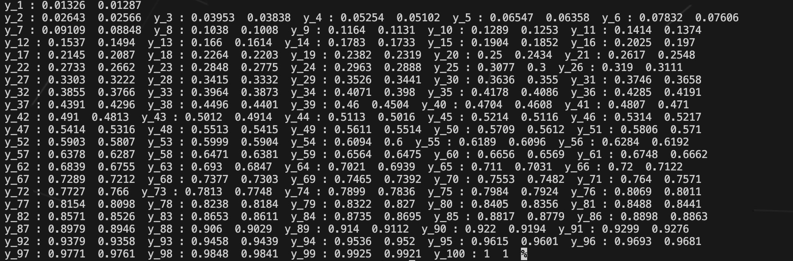
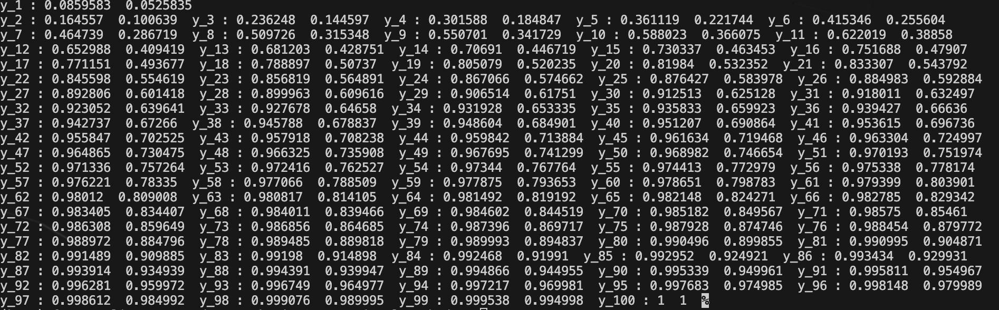
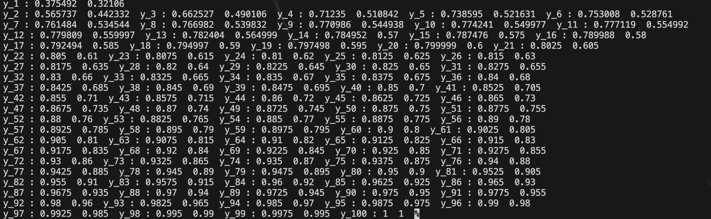
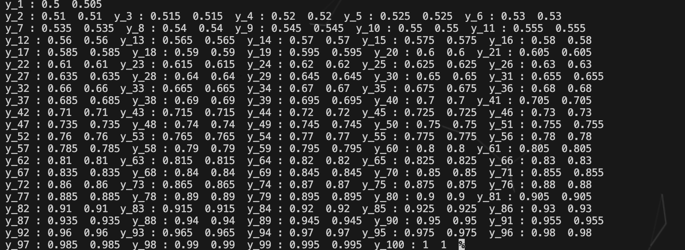

# 计算方法—实验1-实验报告
## 学号：PB22111678
## 姓名：刘俸源

### 算法
#### 问题回顾
本题目的为求解出$T=xP+yQ$等式中的$x$和$y$，其次计算出$Q$对切点为$T$的切线的对称点$R$。问题核心在于如何求解$x$和$y$。在$Computational Mirror Cup and Saucer Art$一文中给出了关于$x$和$y$的二元二次方程组：

$
\begin{cases}
2<Q,P>xy+2|Q|^2y^2-y-1+x=0 \\\\
|P|^2x^2+2<Q,P>xy+|Q|^2y^2-1=0
\end{cases}
$

核心目标即求解该方程组。求解方程组后，可通过简单的计算得出$R$点坐标。

#### 算法内容
采用Newton迭代法求解该多元高次方程组。具体步骤如下：
1. 建立如下方程组：
   

   $
   \begin{cases}
   \Delta x\frac{\partial f(x_0,y_0)}{\partial x}+\Delta y \frac{\partial f(x_0,y_0)}{\partial y}=-f(x_0,y_0)\\\\
   \Delta x\frac{\partial g(x_0,y_0)}{\partial x}+\Delta y \frac{\partial g(x_0,y_0)}{\partial y}=-g(x_0,y_0)
   \end{cases}
   $

   

其中$x_0$和$y_0$是给定的初值。计算得到$\Delta x$和$\Delta y$。
1. 将$x_0$和$y_0$替换为$x_0+\Delta x$和$y_0+\Delta y$。
2. 重复步骤1，2直到$max\{\Delta x,\Delta y\}≤\epsilon(\epsilon=10^{-3})$或迭代次数大于100，因为可能会出现初值赋值偏离较大，无法迭代出正确数值解并产生死循环的问题。
3. 得到最后的解：$(x,y)$。
4. 根据几何关系，能得到如下方程组：
   

   
   $
   \begin{cases}
   \frac{|Q_xx+Q_yy-1|}{\sqrt{(x^2+y^2)}}=\frac{|R_xx+R_yy-1|}{\sqrt{(x^2+y^2)}}\\\\
   \frac{Q_x-R_x}{x}=\frac{Q_y-R_y}{y}
   \end{cases}
   $

   

   可解出$R_x$和$R_y$。
### 实验结果
- $P=(−1.000001,0),Q=(-2,2)$
  
- $P=(−2,0),Q=(-1,0.000001)$
  
- $P=(−2.33,0),Q=(-3,1)$
  
- $P=(−3,0),Q=(-1,0.5)$
  
- $P=(−3,0),Q=(-2,10)$
  
- $P=(−3,0),Q=(-2,10)$
  
- $P=(−10,0),Q=(-2,1)$
  
- $P=(−1024,0),Q=(-8,4)$
  
### 结果与分析
#### 结果
$x$和$y$即为问题回顾中所求值，并得出了所求的$R$点坐标。
#### 数值精度与稳健性问题
1. 数值精度：在小数点六位以后精度较差，比如在计算$P=(−1.000001,0),Q=(-2,2)$时对于$y$的计算出现了不同初值得出不同解但都符合问题的情况（此时$y\to 0$），属于数值精度问题。
   - 改进方法：本次实验中数据类型全部为double类型，可改为long double类型或使用高精度数学库Boost等。
2. 稳健性问题：比较依赖初值范围，初值范围不太匹配容易出现得到错误解或无解问题。不过本题关于$T$点大致位置的寻求比较直观，根据给定的$P,Q$对初值进行更改相对容易，不会出现无信息的盲目赋值问题。

