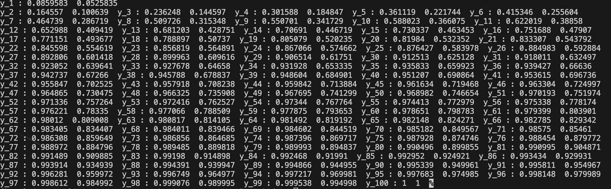
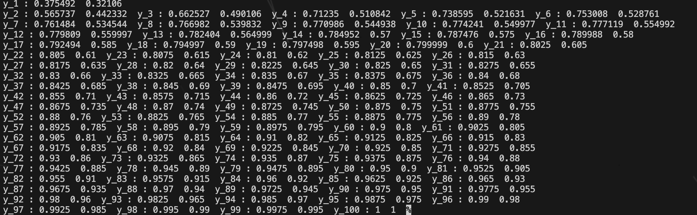
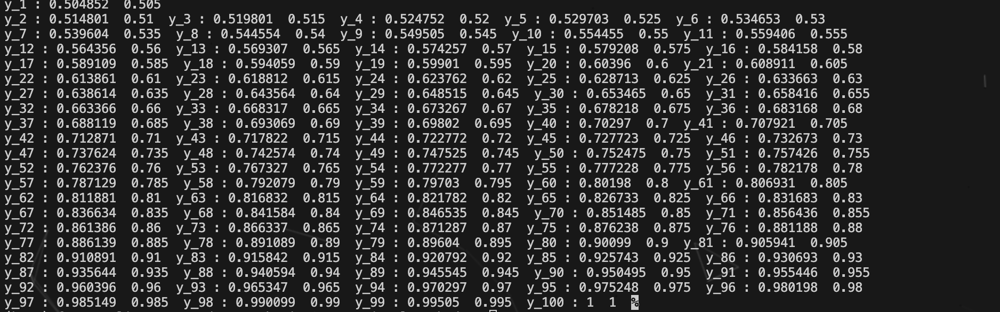
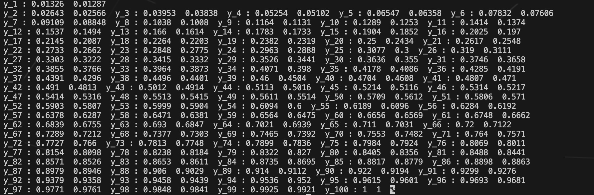
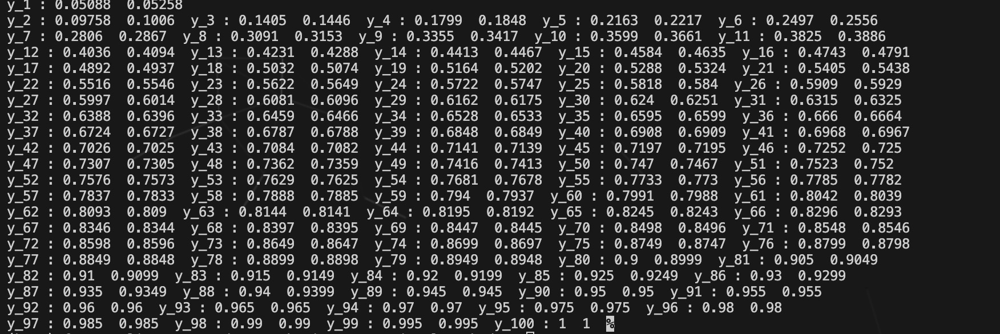
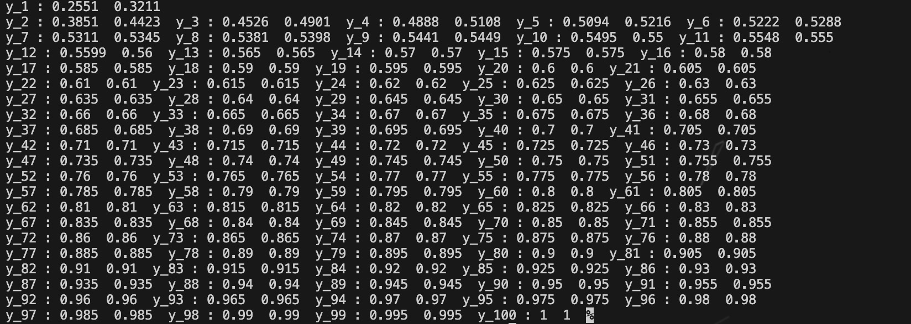
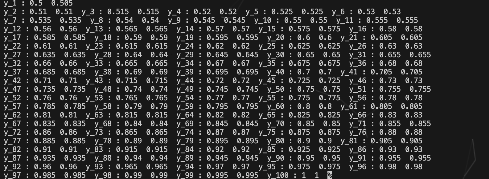

# Lab2 Report
## 姓名：刘俸源
## 学号：PB22111678

### 1.Gauss列主元法
#### 实验结果
1. $\epsilon=1$
   
2. $\epsilon=0.1$
   
3. $\epsilon=0.01$
   
4. $\epsilon=0.0001$
   
#### 分析
$y\_i$代表$x=i/100$时的$y$值，输出共两列，左侧为列主元法得到的解，右侧为精确解。可以看到，当$\epsilon$越小，求得解越接近精确解。
### 2.Gauss-Seidel迭代法
#### 实验结果
1. $\epsilon=1$
   
2. $\epsilon=0.1$
   
3. $\epsilon=0.01$
   
4. $\epsilon=0.0001$
   
#### 分析
$y\_i$代表$x=i/100$时的$y$值，输出共两列，左侧为迭代法得到的解，右侧为精确解。本次实验迭代终止条件为$||x_2-x_1||_{\infty}<10^{-5}$，平均误差不超过1\%。且可以观察到，当$\epsilon$越小，求得解越接近精确解。
### 算法的比较
Gauss列主元法从理论上来讲更为精确，但较为麻烦，且需要满足各阶顺序主子式都不为0；Gauss-Seidel迭代方法简单易行，但精确度不如前者，且较依赖所给定的初值。