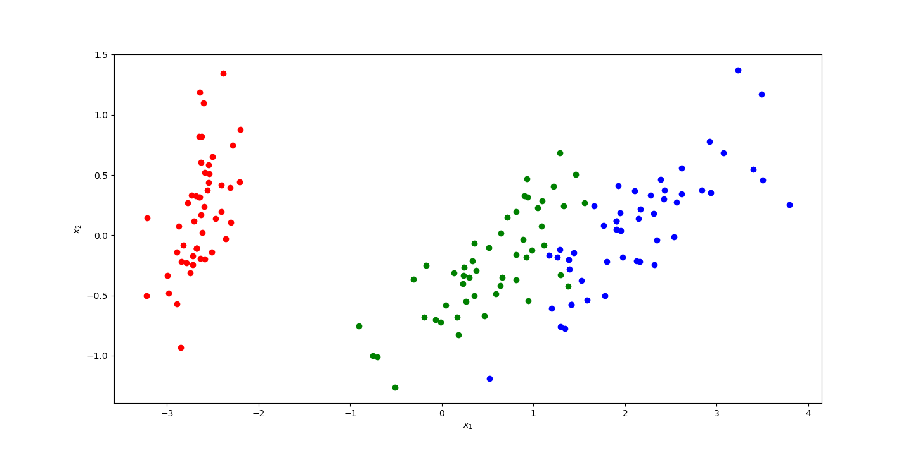

# Lab4 Report
## 学号：PB22111678
## 姓名：刘俸源
## 实验结果
### (a)
初始矩阵A:
|$0.07$|$0.49$|$0.73$|
|---|---|---|   
|$0.58$|$0.3$|$0.72$|
|$0.44$|$0.78$|$0.23$|
|$0.09$|$0.4$|$0.65$|

#### Jacobi分解
迭代中每次更新的矩阵非对角元素平方和： 
sum: 3.77045 
sum: 2.04743 
sum: 0.0136925 
sum: 0.00427393 
sum: 0.00274824 
sum: 0.00130609 
sum: 0.000111294 
sum: 3.17075e-06 
sum: 1.05074e-07 
sum: 6.46387e-09 
sum: 1.82849e-09 
sum: 6.45523e-11 
sum: 9.26736e-14 
 

#### SVD分解

$U$:

|$0.511006$|$-0.358201$|$0.458509$|$-0.632719$|
|:---:|:---:|:---:|:---:|  
|$0.553476$|$-0.145339$|$-0.817645$|$-0.0632304$|
|$0.481335$|$0.859284$|$0.171054$|$0.0262335$|
|$0.448167$|$-0.334962$|$0.303261$|$0.771349$|

$\Sigma$:

|$1.64046$|$0$|$0$|
|:---:|:---:|:---:|
|$0$|$0.553766$|$0$|
|$0$|$0$|$0.412828$|
|$0$|$0$|$0$|

$V^T$

|$0.371181$|$0.591994$|$0.715379$|
|:---:|:---:|:---:|   
|$0.43081$|$0.57269$|$-0.697445$|
|$0.822574$|$-0.567071$|$0.0424649$|

### (b)
#### 协方差矩阵

$\frac 1 m XX^T$:

|$0.681122$|$-0.0390067$|$1.26519$|$0.513458$|
|:---:|:---:|:---:|:---:|
|$-0.0390067$|$0.1867515$|$-0.319568$|$-0.117195$|
|$1.26519$|$-0.319568$|$0.000137441$|$1.28774$|
|$0.513458$|$-0.117195$|$1.28774$|$0.578532$|

#### 可视化结果

## 结果分析
### (a)
非对角线元素平方和呈下降趋势；
对于求得的四个特征值，分别计算$det(AA^T-\lambda_iI)$如下（按特征值大小排列）：
1. $\lambda_1$: 0.00005227
2. $\lambda_2$: -0.00000004
3. $\lambda_3$: 0.00000002
4. $\lambda_4$: 0.00000000
### (b)
该图共有两个坐标轴，横轴为$x_1$，纵轴为$x_2$，分别代表着对原数据经过PCA后，在最大的两个特征值对应的单位特征向量上的投影值；标签为0，1，2的数据在图中分别以红色、绿色、蓝色呈现。