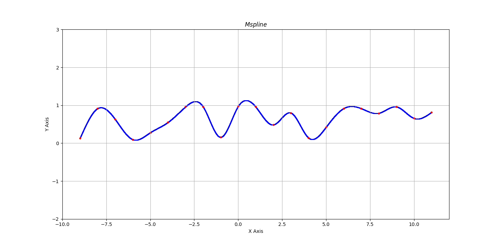
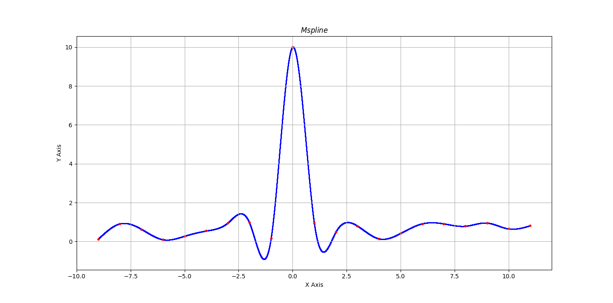

# Lab5 Report
## 学号：PB22111678
## 姓名：刘俸源
### 问题描述
实现三次样条插值算法，给定插值点，利用大M法计算三次样条插值函数。
### 问题分析
题目情景为：
1. 给定木条与压铁位置，求木条（插值函数）各段的函数表达式，且为三次样条函数。
2. 将第10个压铁的位置移动至(0,10)，计算出新的曲线，观察每个区间内的三次函数是否改变。
### 求解方法
使用大M法求解各段函数表达式，具体方法为：
1. 读取数据
2. 利用自然边界条件及大M法，求得$M_0,M_1,M_2,...,M_n$的值
3. 代回$S(x)$式进行原函数求解
4. 可视化
### 实验结果与可视化
- (a)：得到的样条函数 
[-9,-8]: $-0.254241x^3+-6.86449x^2+-60.7398x+-175.849$ 
[-8,-7]: $0.203803x^3+4.12854x^2+27.2045x+58.6696$ 
[-7,-6]: $0.25253x^3+5.15181x^2+34.3673x+75.3829$ 
[-6,-5]: $-0.244121x^3+-3.7879x^2+-19.2709x+-31.8937$ 
[-5,-4]: $0.0954546x^3+1.30573x^2+6.19725x+10.5533$ 
[-4,-3]: $-0.0828972x^3+-0.834491x^2+-2.36364x+-0.861222$ 
[-3,-2]: $-0.309266x^3+-2.87181x^2+-8.47559x+-6.97317$ 
[-2,-1]: $0.90846x^3+4.43455x^2+6.13712x+2.76864$ 
[-1,0]: $-0.889575x^3+-0.959557x^2+0.743018x+0.9706$ 
[0,1]: $0.203139x^3+-0.959557x^2+0.743018x+0.9706$ 
[1,2]: $0.445017x^3+-1.68519x^2+1.46865x+0.728722$ 
[2,3]: $-0.738108x^3+5.41356x^2+-12.7289x+10.1937$ 
[3,4]: $0.747415x^3+-7.95615x^2+27.3803x+-29.9154$ 
[4,5]: $-0.339953x^3+5.09227x^2+-24.8134x+39.6762$ 
[5,6]: $-0.111902x^3+1.67151x^2+-7.7096x+11.1698$ 
[6,7]: $0.0796627x^3+-1.77666x^2+12.9794x+-30.2082$ 
[7,8]: $0.163651x^3+-3.54043x^2+25.3258x+-59.0164$ 
[8,9]: $-0.319969x^3+8.06646x^2+-67.5293x+188.597$ 
[9,10]: $0.354323x^3+-10.1394x^2+96.3237x+-302.962$ 
[10,11]: $-0.163425x^3+5.39301x^2+-59.0007x+214.786$ 
可视化：

- (b)：得到的样条函数： 
[-9,-8]: $-0.254626x^3+-6.87491x^2+-60.8332x+-176.126$ 
[-8,-7]: $0.205731x^3+4.17367x^2+27.5555x+59.5768$ 
[-7,-6]: $0.245201x^3+5.00253x^2+33.3575x+73.1148$ 
[-6,-5]: $-0.216734x^3+-3.3123x^2+-16.5315x+-26.6632$ 
[-5,-4]: $-0.00676361x^3+-0.162739x^2+-0.783675x+-0.41684$ 
[-4,-3]: $0.298589x^3+3.50149x^2+13.8732x+19.1257$ 
[-3,-2]: $-1.73299x^3+-14.7827x^2+-40.9794x+-35.7269$ 
[-2,-1]: $6.22188x^3+32.9465x^2+54.479x+27.912$ 
[-1,0]: $-11.6901x^3+-20.7895x^2+0.743018x+10$ 
[0,1]: $11.0037x^3+-20.7895x^2+0.743018x+10$ 
[1,2]: $-4.8684x^3+26.8267x^2+-46.8732x+25.8721$ 
[2,3]: $0.685617x^3+-6.49736x^2+19.775x+-18.5601$ 
[3,4]: $0.365929x^3+-3.62017x^2+11.1434x+-9.92847$ 
[4,5]: $-0.237734x^3+3.62379x^2+-17.8325x+28.706$ 
[5,6]: $-0.139292x^3+2.14716x^2+-10.4493x+16.4007$ 
[6,7]: $0.0870017x^3+-1.92613x^2+13.9904x+-32.4787$ 
[7,8]: $0.161685x^3+-3.49448x^2+24.9689x+-58.0952$ 
[8,9]: $-0.319443x^3+8.05258x^2+-67.4076x+188.242$ 
[9,10]: $0.354185x^3+-10.1354x^2+96.2838x+-302.832$ 
[10,11]: $-0.163397x^3+5.3921x^2+-58.9907x+214.75$ 
可视化：

### 结果分析
- (a)：上述结果给出了各段的函数表达式，以及对应的可视化曲线。曲线横轴代表木条x坐标，纵轴代表木条y坐标；蓝色曲线为插值曲线，红色点为插值点（压铁）；
- (b)：有改变。x坐标越接近0的区间函数表达式变化越大，其中[-1,0]，[0,1]两个区间函数表达式变化最大。