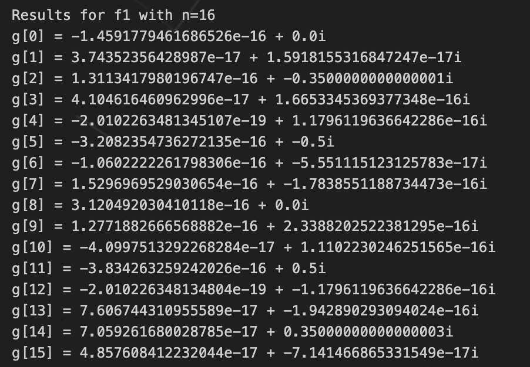
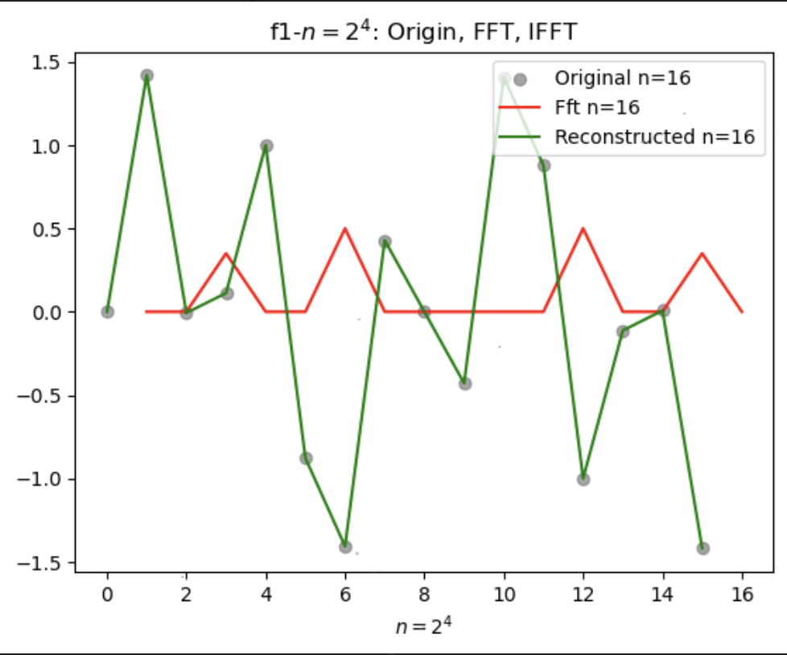
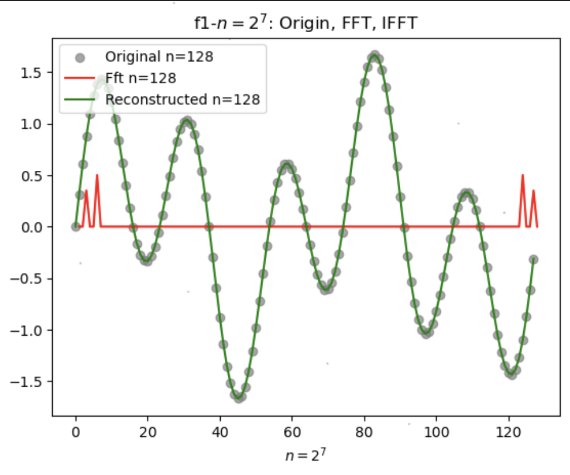
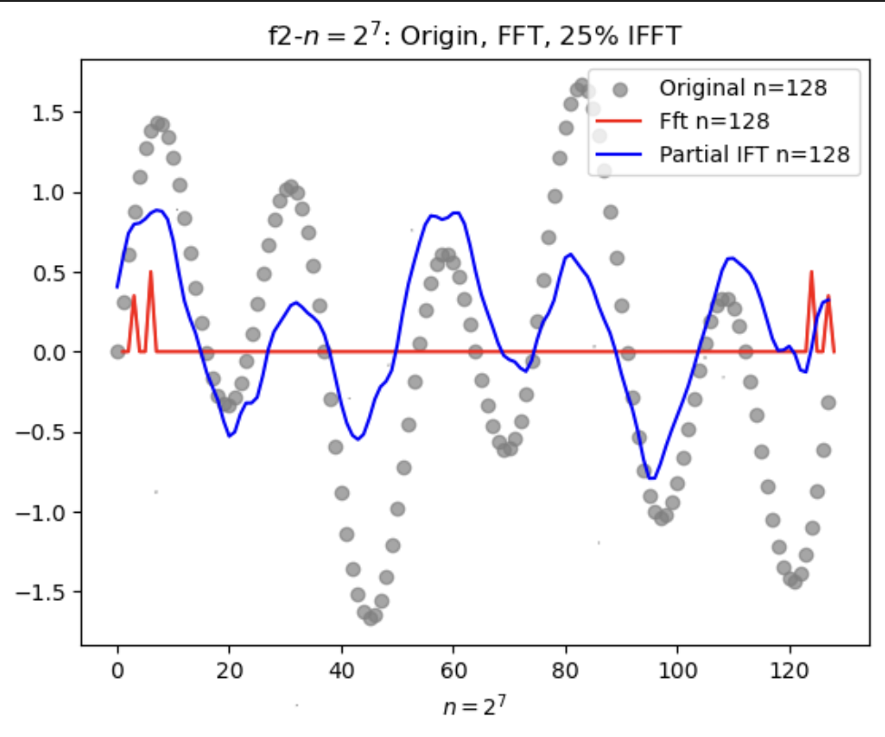

# Lab6 Report

### 问题描述
通过快速傅里叶变换与快速傅里叶逆变换实现对给定函数的 Fourier 分析以及重建。
### 问题分析
给定了两个函数及两个划分数，要求在$[0,1]$区间上实现快速傅立叶变换（FFT）及快速傅立叶逆变换（IFFT），其中$f_2$函数还额外要求在快速傅立叶变换之后进行低频逆变换。
### 求解方法
使用教材及实验文档所给出的算法进行代码构建。
### 实验结果与可视化
- $f_1,n=2^4$
  - $g$:
  - 可视化结果:
- $f_1,n=2^7$
  - $g$:
    ```cpp
    Results for f1 with n=128
    g[0] = 1.2759147776309221e-18 + 0.0i
    g[1] = 6.035182601442681e-19 + 2.677694427786778e-17i
    g[2] = -2.063522187786148e-17 + -0.35i
    g[3] = 2.5560190833110646e-17 + 6.208454474902054e-17i
    g[4] = 1.8475808887944612e-17 + 4.474046235274906e-17i
    g[5] = -2.673919582990592e-16 + -0.5i
    g[6] = 2.992871931844486e-17 + -5.8640362247141e-17i
    g[7] = 3.4233868592047574e-17 + -5.828213350038081e-17i
    g[8] = 1.2800629005729518e-17 + -6.922143771233402e-17i
    g[9] = 1.0614451978324275e-17 + -2.3997757962507117e-17i
    g[10] = 2.6294772579768353e-17 + -6.524921378831371e-17i
    g[11] = 7.49689289233326e-17 + -1.926215218009498e-17i
    g[12] = 5.104604423274681e-17 + -5.1955446770706516e-17i
    g[13] = -1.1560183246258624e-17 + 3.7151232518090833e-17i
    g[14] = 1.3251973536707365e-17 + -4.273511287381476e-17i
    g[15] = -2.5934954754880127e-17 + -8.90709253201565e-18i
    g[16] = -1.0609365998863499e-17 + -1.3843227873378952e-17i
    g[17] = 7.097245895287992e-18 + -1.0821108246053344e-17i
    g[18] = 2.937063766750346e-17 + -3.9257960080861577e-17i
    g[19] = 2.5537067528471934e-17 + 1.6835330621150022e-17i
    g[20] = 3.6961998723247654e-17 + -3.099884623631246e-17i
    g[21] = -2.930915700706802e-17 + 9.432161476805054e-17i
    g[22] = -1.7680343967518452e-17 + 1.9045104765466855e-17i
    g[23] = -1.436985070860704e-17 + 1.4342269735702853e-17i
    g[24] = -3.8841428903798326e-17 + -4.194989073522929e-17i
    g[25] = 3.302016311164553e-17 + 1.5683295105637783e-17i
    g[26] = -3.3922494655584234e-17 + 1.033390285043833e-17i
    g[27] = -1.8965080763348144e-16 + -8.417063610352298e-17i
    g[28] = -9.68277006267885e-17 + -1.9943241426949968e-17i
    g[29] = 1.330399031061068e-17 + -1.4022756752601644e-16i
    g[30] = -2.269143019065421e-17 + -9.56132523801437e-17i
    g[31] = -6.718184980643945e-18 + 3.824645014184964e-17i
    g[32] = -2.95154269209574e-17 + -2.1250362580715902e-17i
    g[33] = 1.1576597797741557e-17 + 5.267315614486413e-18i
    g[34] = -7.827829654115898e-18 + -1.1456549549559168e-17i
    g[35] = -3.72287331906831e-18 + 3.15057811728168e-19i
    g[36] = -5.936043604757909e-17 + -1.4991692308644952e-17i
    g[37] = 1.8139534781877607e-17 + 9.66084980453488e-18i
    g[38] = -9.791562587499964e-17 + -1.4338561239601737e-17i
    g[39] = 1.595940408231675e-17 + -1.4658899500809215e-16i
    g[40] = 9.84542086638508e-17 + -3.252161860945641e-17i
    g[41] = 1.9923564461860018e-17 + 1.3664429040309208e-17i
    g[42] = 2.6971796134064688e-17 + -2.9174072965553155e-17i
    g[43] = 1.7244009099313294e-17 + 5.0857997877875823e-17i
    g[44] = -3.561265122503963e-18 + -1.3343549820404839e-17i
    g[45] = -1.0966733048583527e-17 + -2.3359656372880998e-17i
    g[46] = -2.460934968673013e-17 + 2.8359584950445934e-20i
    g[47] = 2.2407628212909866e-17 + -5.757926357595231e-17i
    g[48] = 1.5763280768090565e-17 + -5.1696104934949105e-18i
    g[49] = -1.093048762910156e-17 + -4.088501164995292e-18i
    g[50] = 2.084054248573989e-17 + -3.6636369014761216e-17i
    g[51] = 2.907158748019363e-17 + 1.471894780782507e-17i
    g[52] = 3.7704116500650895e-18 + 1.486736996163892e-17i
    g[53] = 4.933898973211269e-18 + -2.581149465308154e-17i
    g[54] = -4.83143937946969e-17 + -3.2938826497609745e-17i
    g[55] = 5.8593912535715e-17 + -5.935901855773067e-17i
    g[56] = 8.3611192754724e-17 + -3.20375899709323e-17i
    g[57] = -1.0757398829476412e-17 + -1.0032622002881313e-17i
    g[58] = 6.241642570955333e-17 + 4.435121288543529e-18i
    g[59] = 3.584958474625427e-17 + -2.220446049250313e-16i
    g[60] = 4.929411566805395e-17 + -1.910166457893096e-17i
    g[61] = -1.5792530902675292e-17 + -1.026040087979676e-17i
    g[62] = 1.166156276291376e-16 + -1.3877787807814457e-16i
    g[63] = 3.255143995696239e-17 + 2.033118892875398e-17i
    g[64] = -9.847068509103549e-17 + 0.0i
    g[65] = 3.428400550906982e-17 + -2.428831688686319e-17i
    g[66] = 8.435342087521557e-17 + -2.7755575615628914e-17i
    g[67] = -1.8543100752311763e-17 + -1.4334612951352361e-18i
    g[68] = 4.929411566805388e-17 + 1.910166457893096e-17i
    g[69] = 1.2470717189697868e-17 + 5.551115123125783e-17i
    g[70] = 5.004850629179864e-17 + -2.7499520273215507e-18i
    g[71] = -3.71226195186798e-18 + 1.69980909963805e-17i
    g[72] = 8.361119275472392e-17 + 3.203758997093227e-17i
    g[73] = 5.126404970362305e-17 + 5.908347036437064e-17i
    g[74] = -4.288759146168769e-17 + 3.753468439124722e-17i
    g[75] = 1.406625822699637e-17 + 4.6646213563898543e-17i
    g[76] = 3.770411650065074e-18 + -1.4867369961638937e-17i
    g[77] = 4.1217486774484875e-17 + -1.113293578553022e-17i
    g[78] = 3.42778272799283e-17 + 4.894993046246265e-17i
    g[79] = -9.232505588848719e-18 + 4.848926584521621e-18i
    g[80] = 1.5763280768090552e-17 + 5.1696104934949105e-18i
    g[81] = 2.0278231129775947e-17 + 5.543402306060472e-17i
    g[82] = -3.553598738100638e-17 + -1.2317093046079066e-17i
    g[83] = -6.7406406086509145e-18 + 9.066056874406345e-18i
    g[84] = -3.56126512250396e-18 + 1.3343549820404825e-17i
    g[85] = 9.942684391786586e-18 + -3.7978434597670697e-17i
    g[86] = 1.483364858606235e-17 + 2.623717733048174e-17i
    g[87] = 2.2917781031853083e-17 + -6.211117365406085e-18i
    g[88] = 9.845420866385076e-17 + 3.2521618609456443e-17i
    g[89] = 1.1356610504911763e-17 + 1.4543472162501285e-16i
    g[90] = -9.242258972565972e-17 + 3.393785199520979e-17i
    g[91] = 1.3854498623264737e-16 + -1.3787396882150833e-16i
    g[92] = -5.936043604757914e-17 + 1.4991692308644976e-17i
    g[93] = 1.4634464983984925e-17 + -1.0061520950569497e-17i
    g[94] = 8.643600846500005e-17 + -7.092020131362978e-17i
    g[95] = 1.3089217196019847e-17 + -2.843567929903659e-18i
    g[96] = -2.951542692095741e-17 + 2.1250362580715902e-17i
    g[97] = -8.35460784148574e-18 + -3.6641908582212475e-17i
    g[98] = 7.809853256269205e-17 + 1.1456549549559168e-17i
    g[99] = 9.623459181282867e-18 + 1.1083572304691194e-16i
    g[100] = -9.682770062678845e-17 + 1.994324142694995e-17i
    g[101] = -7.949192950182616e-17 + -3.7416425420163794e-17i
    g[102] = -4.9638325757079003e-17 + -2.5655417022136154e-17i
    g[103] = 3.0615207428092326e-17 + -6.748713383612945e-18i
    g[104] = -3.884142890379834e-17 + 4.194989073522926e-17i
    g[105] = -1.6368116320665823e-17 + -1.859885088565833e-17i
    g[106] = -9.257109112837837e-18 + -1.6725476663162285e-17i
    g[107] = -8.185462854907195e-18 + -5.0486483646050474e-17i
    g[108] = 3.696199872324763e-17 + 3.0998846236312483e-17i
    g[109] = 1.9238471630752653e-17 + 2.7094129943830055e-19i
    g[110] = 1.4500979237222803e-18 + 7.70235496732884e-17i
    g[111] = 1.7269276993539718e-17 + 1.5785796878005626e-17i
    g[112] = -1.0609365998863508e-17 + 1.3843227873378952e-17i
    g[113] = -1.7119267478533582e-17 + 4.2797072440126285e-18i
    g[114] = -1.7529914876199727e-17 + 3.270027091044403e-17i
    g[115] = -1.9739525733398126e-17 + -4.588874592213336e-17i
    g[116] = 5.104604423274684e-17 + 5.1955446770706546e-17i
    g[117] = 9.882662108658703e-18 + -3.0531685517298304e-17i
    g[118] = 1.2715592580005076e-17 + 3.352968570660376e-17i
    g[119] = 8.7316342807568e-18 + 6.746410519579454e-17i
    g[120] = 1.2800629005729474e-17 + 6.922143771233406e-17i
    g[121] = 2.8665502055466417e-17 + 5.2645339939529205e-17i
    g[122] = 2.1809277240114814e-17 + 1.3592950535410597e-16i
    g[123] = -4.662638226643579e-16 + 0.5000000000000004i
    g[124] = 1.847580888794464e-17 + -4.4740462352749095e-17i
    g[125] = 2.59924766072402e-17 + -3.6669121612137616e-17i
    g[126] = -1.341381381568234e-16 + 0.3500000000000003i
    g[127] = 5.144167087261414e-18 + -8.129710714857473e-17i
    ```
  - 可视化结果:
- $f_2,n=2^4$
  - $g$:
    ```cpp
    Results for f2 with n=16
    g[0] = 0.09374999999999989 + 0.0i
    g[1] = -0.0046556790249889565 + 0.007510196555815755i
    g[2] = 0.3500000000000001 + -0.01875000000000012i
    g[3] = 0.007510196555815699 + -0.01563917473049331i
    g[4] = 0.01875000000000002 + 0.037500000000000054i
    g[5] = 0.05650630773867958 + -0.504655679024989i
    g[6] = -2.7755575615628914e-17 + 0.01874999999999994i
    g[7] = 0.01563917473049354 + -0.056506307738679956i
    g[8] = 0.018750000000000266 + 0.0i
    g[9] = 0.015639174730493484 + 0.05650630773868001i
    g[10] = -2.7755575615628914e-17 + -0.01874999999999994i
    g[11] = 0.05650630773867951 + 0.504655679024989i
    g[12] = 0.018750000000000013 + -0.037500000000000054i
    g[13] = 0.007510196555815769 + 0.015639174730493255i
    g[14] = 0.3500000000000001 + 0.01875000000000012i
    g[15] = -0.004655679024988937 + -0.00751019655581581i
    ```
- $f_2,n=2^7$
  - $g$:
    ```cpp
    Results for f2 with n=128
    g[0] = 0.159375 + 0.0i
    g[1] = -0.0026520552989948024 + -0.004322250977003861i
    g[2] = 0.36028201977442026 + 0.009510485709100739i
    g[3] = -0.002945281826595237 + -0.016611186051164486i
    g[4] = -0.008317400622373194 + 0.004898846801581938i
    g[5] = -0.015819092619360826 + -0.4967108877299383i
    g[6] = -0.005298986410329325 + -0.0019471354474904275i
    g[7] = -0.005913714585646811 + -0.010787064179725553i
    g[8] = -0.004285376073623867 + -0.0042506978864712466i
    g[9] = -0.009399471684244256 + -0.0029299059918490196i
    g[10] = -0.001992044863213239 + -0.0015383787438091392i
    g[11] = -0.0033610108593827076 + -0.006137854310082989i
    g[12] = -0.003409804729445521 + 0.0074335014789916965i
    g[13] = -0.012795049683724325 + 0.012861489963656636i
    g[14] = -0.008364732076934733 + 0.001991697816150091i
    g[15] = 0.008907924314867938 + -0.01898475764707166i
    g[16] = 0.01794575214724778 + 0.005256189110435825i
    g[17] = -0.008585061347537134 + -0.018087504550092764i
    g[18] = -0.0012606473775597163 + -0.0030559219662342992i
    g[19] = 0.0009692972274097363 + -0.003771439836150462i
    g[20] = -0.012435978277132059 + 0.010187369507654104i
    g[21] = 0.014065253392377276 + 0.00501572535977892i
    g[22] = -0.00516645233075636 + 0.002069330799773938i
    g[23] = -0.02154758266322356 + 0.00752020262866527i
    g[24] = 0.008972876073623843 + 0.01092140006755075i
    g[25] = -0.006112622573742289 + -0.002883244669272209i
    g[26] = -0.007575826035399712 + -0.012144919353062117i
    g[27] = 0.0016356925163724 + 0.008278798529188735i
    g[28] = -0.008678453685476295 + 0.00018613474632698558i
    g[29] = -0.008904706072601533 + 0.0008553888815749115i
    g[30] = 0.009144031754923196 + -0.002247218536136809i
    g[31] = 0.002588600516789957 + -0.004711854011085548i
    g[32] = -0.00937500000000003 + -0.004687500000000015i
    g[33] = 0.010452273297476708 + -0.003774980837340908i
    g[34] = 0.005550626748154596 + -0.014820972163546813i
    g[35] = -0.0052346991089656965 + -0.0022234225263948644i
    g[36] = -0.018201763220675675 + -0.011789798907778266i
    g[37] = 0.015409810641730247 + -0.01208434982175492i
    g[38] = -0.0026151323259563045 + 0.0019553676983799515i
    g[39] = 0.005338273411105795 + -0.0063397068402577415i
    g[40] = 0.008972876073623962 + 0.02223802614117462i
    g[41] = -0.011205608455754284 + -0.005966061347696746i
    g[42] = -0.004938284158595478 + -0.0024772432268102473i
    g[43] = -0.009675585549416891 + -0.005560123003532504i
    g[44] = 0.022765880826438507 + 0.010460463649264923i
    g[45] = 0.0033554681136369197 + 0.004463825948009209i
    g[46] = -0.014579091916609402 + -0.0025230381217752965i
    g[47] = -0.010803692150599812 + 0.0025523918520772137i
    g[48] = -0.008570752147247765 + 0.014631189110435825i
    g[49] = -0.011486238579092738 + 0.007924198723588738i
    g[50] = 0.016552325105342228 + 0.015069204425150232i
    g[51] = 0.020869392753892792 + -0.005934318256186321i
    g[52] = 0.0035922804010107925 + 0.014335721694226394i
    g[53] = 0.006836100994894722 + 0.0008024790662850135i
    g[54] = 0.0003245854657652381 + 0.012960642198431734i
    g[55] = 0.003517924637768252 + 0.012096421167180377i
    g[56] = -0.004285376073623816 + -0.0023090718128473383i
    g[57] = -0.011183505824942614 + 0.00961338575969153i
    g[58] = 0.0007456363639896345 + -0.014067757721718765i
    g[59] = -0.00443548949222554 + -0.007068050897018674i
    g[60] = 0.005935239307653468 + -0.0004479607788995068i
    g[61] = -0.01095359613354601 + 0.009785236275542696i
    g[62] = 0.009191972282758892 + 0.001714850551736489i
    g[63] = 0.004068052691274205 + -0.012755492565262302i
    g[64] = 0.009374999999999911 + 0.0i
    g[65] = 0.004068052691274183 + 0.012755492565262283i
    g[66] = 0.009191972282759087 + -0.0017148505517365267i
    g[67] = -0.010953596133546024 + -0.009785236275542676i
    g[68] = 0.005935239307653452 + 0.0004479607788995055i
    g[69] = -0.004435489492225589 + 0.007068050897018452i
    g[70] = 0.0007456363639896245 + 0.01406775772171876i
    g[71] = -0.011183505824942598 + -0.009613385759691534i
    g[72] = -0.004285376073623806 + 0.002309071812847333i
    g[73] = 0.003517924637768264 + -0.01209642116718037i
    g[74] = 0.00032458546576523656 + -0.012960642198431727i
    g[75] = 0.006836100994894752 + -0.000802479066284978i
    g[76] = 0.0035922804010107895 + -0.014335721694226384i
    g[77] = 0.020869392753892803 + 0.005934318256186346i
    g[78] = 0.016552325105342255 + -0.015069204425150235i
    g[79] = -0.011486238579092738 + -0.007924198723588724i
    g[80] = -0.008570752147247755 + -0.014631189110435826i
    g[81] = -0.01080369215059983 + -0.002552391852077218i
    g[82] = -0.014579091916609416 + 0.002523038121775284i
    g[83] = 0.003355468113636897 + -0.004463825948009215i
    g[84] = 0.02276588082643851 + -0.010460463649264912i
    g[85] = -0.009675585549416908 + 0.005560123003532495i
    g[86] = -0.0049382841585954695 + 0.002477243226810239i
    g[87] = -0.011205608455754284 + 0.005966061347696749i
    g[88] = 0.008972876073623974 + -0.02223802614117462i
    g[89] = 0.00533827341110578 + 0.006339706840257742i
    g[90] = -0.002615132325956317 + -0.0019553676983799385i
    g[91] = 0.01540981064173038 + 0.012084349821754815i
    g[92] = -0.018201763220675682 + 0.011789798907778268i
    g[93] = -0.005234699108965692 + 0.0022234225263948687i
    g[94] = 0.0055506267481544675 + 0.014820972163546697i
    g[95] = 0.010452273297476708 + 0.003774980837340922i
    g[96] = -0.00937500000000003 + 0.004687500000000015i
    g[97] = 0.002588600516789965 + 0.00471185401108554i
    g[98] = 0.009144031754923317 + 0.002247218536136919i
    g[99] = -0.008904706072601548 + -0.0008553888815749312i
    g[100] = -0.008678453685476296 + -0.00018613474632698471i
    g[101] = 0.0016356925163724997 + -0.008278798529188823i
    g[102] = -0.0075758260353997135 + 0.012144919353062115i
    g[103] = -0.006112622573742277 + 0.0028832446692722115i
    g[104] = 0.008972876073623844 + -0.01092140006755075i
    g[105] = -0.02154758266322355 + -0.007520202628665278i
    g[106] = -0.005166452330756365 + -0.0020693307997739427i
    g[107] = 0.014065253392377273 + -0.005015725359778839i
    g[108] = -0.012435978277132057 + -0.010187369507654111i
    g[109] = 0.0009692972274097311 + 0.003771439836150486i
    g[110] = -0.0012606473775596426 + 0.003055921966234317i
    g[111] = -0.008585061347537145 + 0.018087504550092767i
    g[112] = 0.017945752147247786 + -0.005256189110435823i
    g[113] = 0.008907924314867952 + 0.018984757647071665i
    g[114] = -0.008364732076934701 + -0.0019916978161501533i
    g[115] = -0.012795049683724326 + -0.012861489963656691i
    g[116] = -0.0034098047294455233 + -0.0074335014789917025i
    g[117] = -0.0033610108593827674 + 0.006137854310082937i
    g[118] = -0.0019920448632132523 + 0.001538378743809147i
    g[119] = -0.009399471684244255 + 0.002929905991849064i
    g[120] = -0.004285376073623868 + 0.004250697886471252i
    g[121] = -0.005913714585646827 + 0.010787064179725563i
    g[122] = -0.005298986410329322 + 0.0019471354474904223i
    g[123] = -0.015819092619361038 + 0.49671088772993877i
    g[124] = -0.008317400622373197 + -0.0048988468015819485i
    g[125] = -0.002945281826595223 + 0.0166111860511645i
    g[126] = 0.36028201977442065 + -0.009510485709100644i
    g[127] = -0.0026520552989948098 + 0.004322250977003808i
    ```
  - 可视化结果:
### 结果分析
- 关于图像与数据的解释
  1. 所有图像横轴为频率，纵轴为复值函数的模长
  2. 关于数据，向量$g$的长度即为划分数，结果均以$a+bi$的表示法呈现
- 采样数目n对结果的影响以及对重建（傅里叶逆变换）后的结果造成的影响：采样数目越大，频谱分辨率越高，可以捕获更多的频率信息，也就是说会更好的重建信号，从$f_1$对于不同划分数的变换及重建来看，划分数$n=2^7$相比划分数$n=2^4$对原函数有着更好的重建作用
- 去掉高频系数重建对结果造成的影响：从实验结果来看，重建效果，精度下降。由于高频段信息丢失，导致逆变换对原函数的重构效果变弱