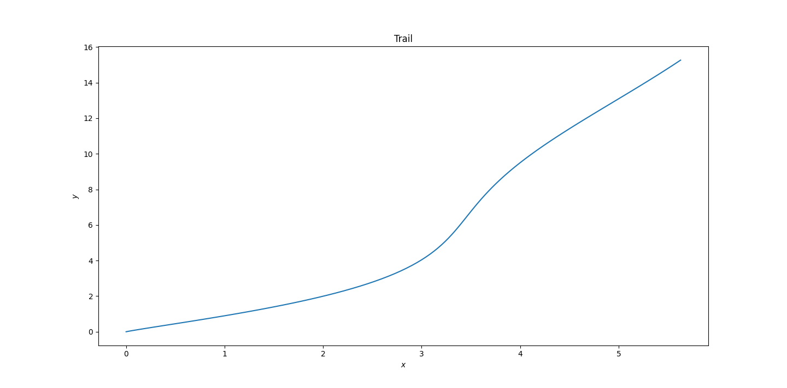

# Lab7 Report
## 姓名：刘俸源
## 学号：PB22111678
## 问题描述
实验文档中给定了加速度$a_x$，$a_y$及时间点，需要求解给定时间点的速度、位移
## 问题分析
1. 按照要求使用Romberg算法进行数值积分
2. $x(t)$为二重积分，不能直接使用Romberg算法，需进行一些转换：
   $$x(t)=\int^t_0\int_0^s a_x(r)drds$$
   $$=\int_0^t (t-s)a_x(s)ds$$
   即对新函数$(t-s)a_x(s)$使用Romberg积分算法

## 算法描述
按照要求使用Rmomberg积分算法：
1. $n=1,h=b-a$
2. $R_{1,1}=(f(a)+f(b))h/2$
3. for $k=2$ to $M$
   - $R_{k,1}=(R_{k-1,1}+h_{k-1}\Sigma_{i=1}^{2^{k-2}} f(a+(2i-1)h_k))/2$
   - for $j=2$ to k:
     - $R_{k,j}=R_{k,j-1}+(R_{k,j-1}-R_{k-1,j-1})/(4^{j-1}-1)$
     - if $|R_{k,k}-R_{k-1,k-1}|<e$ :exit
4. return $R_{k,k}$

对于速度的求解，上述算法中$f$即为不同方向的加速度；对于位移的求解则需按问题分析中所述对$f$进行变换，再进行Romberg积分
## 实验结果
绘制轨迹如下：

## 结果分析
- 本实验未对不同M的选取及分析作要求
- 实验结果中图即为数值积分得到的质点位移轨迹，横轴代表题目中x方向，纵轴代表y方向